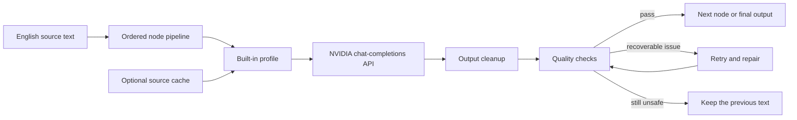

# De-AI Humanizer Workbench

[简体中文](README.zh-CN.md) | English


De-AI is a local browser workbench for revising formulaic English prose through an ordered pipeline of rewrite nodes. A user pastes text, chooses and reorders nodes, and sends the pipeline to a configured NVIDIA chat-completions model. The Python backend cleans each response, checks paragraph structure and protected facts, and retries or repairs output that drops important content. The project includes 88 node definitions across academic, anti-slop, skill, MCP, Python, Node/Web, detector-oriented, and reference-application categories.


## What this demo is

This is an orchestration and quality-control demo, not a collection of 88 independent models. Each node combines:

1. One of eight built-in editorial profiles maintained in this repository.
2. Node-specific metadata such as its purpose, category, and upstream project.
3. Optional text references from a locally cached upstream GitHub repository.
4. A shared system instruction that protects facts, structure, and technical tokens.

The pipeline passes one node's cleaned output to the next node. This makes the order visible and adjustable while keeping the model call, validation, and fallback behavior in one backend.

## At a glance

| Area | Implementation |
| --- | --- |
| Backend | Python standard library, `ThreadingHTTPServer` |
| Frontend | React 18 loaded as ES modules; no build step |
| Model interface | NVIDIA chat-completions endpoint configured by the user |
| Node library | 88 adapter definitions in 8 categories |
| Built-in guidance | 8 project-owned editorial profiles |
| Optional references | Shallow-cloned upstream repositories, ignored by Git |
| Quality controls | Cleanup, protected-term checks, paragraph checks, retry, repair, conservative fallback |
| Automated QA | 110 offline tests with a mocked model call |
| Installation | No Python package installation required |

## Why it exists

Model-generated drafts often have two separate problems: the prose can be generic, and a rewrite can accidentally damage details that matter. De-AI treats those as separate engineering concerns. Rewrite nodes influence wording and rhythm; a shared quality layer checks whether the result still contains the source's numbers, citations, URLs, file paths, issue IDs, dates, money values, standards, code spans, and paragraph structure.

That design does not guarantee perfect writing or detector outcomes. It gives the user a visible pipeline and a repeatable place to inspect, reject, retry, or extend rewrite behavior.

## Core workflow



For a deeper explanation of trust boundaries, prompt assembly, and fallback behavior, see [Architecture](docs/ARCHITECTURE.md).

## Features

- Paste English prose into a three-column rewrite workbench.
- Build a pipeline from a searchable, category-filtered library of 88 nodes.
- Reorder nodes with drag-and-drop or explicit move controls.
- Apply a run note to the whole pipeline.
- Preserve paragraph count and paragraph order between source and output.
- Protect URLs, emails, file paths, issue IDs, CVEs, DOIs, dates, percentages, money, standards, citations, configuration keys, and inline code.
- Remove model-added headings, detector scores, explanations, Markdown fences, tables, and rule lists.
- Retry a node when its first response fails validation.
- Run a repair prompt and, when needed, a paragraph-local fallback.
- Retain the previous text when a model response remains structurally unsafe.
- Use built-in profiles immediately, with optional upstream source caches for local experimentation.
- Run the backend and frontend without a package manager or build tool.

## Screenshots

| Completed rewrite | Mobile layout |
| --- | --- |
|  |  |

The full capture list and a narrated walkthrough are in [Demo Guide](docs/DEMO.md).

## Requirements

- Python 3.10 or newer.
- Internet access in the browser to load React from `esm.sh`.
- A valid NVIDIA API key and access to the configured model for real rewrites.
- Git only if you want to download optional upstream source caches.

The backend itself uses only the Python standard library.

## Quick start

### 1. Clone

```bash
git clone https://github.com/JiexiaoZhang1/de-ai-humanizer-workbench.git
cd de-ai-humanizer-workbench
```

### 2A. Try the deterministic local demo

To explore the full interface without a credential or model request:

```bash
python3 server.py --demo --host 127.0.0.1 --port 8765
```

Open [http://127.0.0.1:8765](http://127.0.0.1:8765). The status pill explicitly says `demo mode`. This mode applies a small deterministic rewrite to the included sample, stays on the local machine, and exists for screenshots and interface walkthroughs. It is not presented as model output.

### 2B. Configure the API key for real rewrites

The recommended approach is an environment variable:

```bash
export NVIDIA_API_KEY="your-key-here"
```

Alternatively, create a local configuration file:

```bash
cp config.example.json config.local.json
```

Then place the key in `config.local.json`. That file is ignored by Git. Do not put a real key in `config.example.json`, documentation, screenshots, issues, or commits.

### 3. Start the real model-backed server

```bash
python3 server.py --host 127.0.0.1 --port 8765
```

Open [http://127.0.0.1:8765](http://127.0.0.1:8765).

The default bind address is local-only. Do not expose this development server to the public internet without authentication, rate limiting, request controls, and a production web server.

## Configuration

Environment variables override values in `config.local.json`.

| Variable | Local JSON key | Default | Purpose |
| --- | --- | --- | --- |
| `NVIDIA_API_KEY` | `nvidia_api_key` | none | Required credential for real model calls |
| `NVIDIA_API_URL` | `nvidia_url` | NVIDIA chat-completions URL | API endpoint |
| `NVIDIA_MODEL` | `nvidia_model` | `meta/llama-4-maverick-17b-128e-instruct` | Model identifier |
| `DEAI_MAX_TOKENS` | `default_max_tokens` | `2200` | Maximum generated tokens per call |
| `DEAI_TEMPERATURE` | `temperature` | `0.82` | Sampling temperature |
| `DEAI_TOP_P` | `top_p` | `0.95` | Nucleus-sampling threshold |
| `DEAI_CONFIG_FILE` | n/a | `config.local.json` | Alternate local configuration path |

`debug` is available only in the JSON file and defaults to `false`. When it is false, unexpected backend exceptions are logged locally but are not returned to the browser with a traceback.

## Built-in and source-enhanced modes

Every node works from a built-in profile, so a clean clone does not need the 397 MB source archive used during the original research. The interface labels each node as:

- `Built-in`: project-owned profile and adapter metadata only.
- `Source cached`: built-in profile plus selected text files from that node's locally downloaded upstream repository.

Fetch the two default sources:

```bash
python3 tools/fetch_sources.py
```

Fetch specific adapters:

```bash
python3 tools/fetch_sources.py \
  --id blader_humanizer \
  --id stephenturner_skill_deslop
```

List available IDs or fetch all configured sources:

```bash
python3 tools/fetch_sources.py --list
python3 tools/fetch_sources.py --all
```

Downloaded repositories remain under `repos/english-humanizers/`, keep their upstream licenses, and are excluded from this repository's Git history. The downloader does not install dependencies or execute upstream code. Review a source before using it as prompt material. See [Third-Party Source Index](docs/SOURCES.md).

## API

The browser uses three JSON endpoints:

- `GET /api/health` returns server readiness, key presence, node count, and cached-source count.
- `GET /api/adapters` returns the public node definitions and runtime availability state.
- `POST /api/run` executes an ordered pipeline.

Example request:

```bash
curl -sS http://127.0.0.1:8765/api/run \
  -H 'Content-Type: application/json' \
  -d '{
    "text": "The original English text goes here.",
    "pipeline": ["blader_humanizer", "stephenturner_skill_deslop"],
    "note": "Keep the tone direct and preserve technical terms."
  }'
```

Request and response schemas, error codes, and examples are documented in [API Reference](docs/API.md).

## Quality-control behavior

After every node, the backend:

1. Normalizes line endings and strips outer code fences.
2. Removes common model-added labels, reports, scores, and explanation sections.
3. Restores protected source tokens when a safe textual match is possible.
4. Compares source and output paragraph counts.
5. Detects missing protected terms, unchanged output, extreme length changes, lists, and tables.
6. Retries the node with stricter instructions when validation fails.
7. Runs a repair prompt if the retry is not sufficient.
8. Rewrites one paragraph at a time for persistent structure or compression failures.
9. Keeps the previous text when the result still cannot pass conservative checks.

Warnings are returned in each step record. Passing these checks means the configured invariants were satisfied; it does not prove factual truth, writing quality, authorship, or acceptance by any detector.

## Project structure

```text
.
├── server.py                  # HTTP server, model client, cleanup, and quality gates
├── static/                    # React workbench, HTML metadata, and CSS
├── data/adapters.json         # 88 node definitions
├── prompts/                   # 8 project-owned editorial profiles
├── samples/sample.txt         # Example English input
├── tools/
│   ├── fetch_sources.py       # Optional shallow source downloader
│   ├── check_publication.py   # Tracked-file secret and artifact check
│   └── qa_50_tests.py         # Offline regression suite
├── docs/                      # Architecture, API, demo, pitch, and source index
├── config.example.json        # Safe configuration template
└── .github/                   # CI and contribution templates
```

## Testing

Run the offline suite:

```bash
python3 tools/qa_50_tests.py
```

The suite replaces the remote model call with a deterministic stub and covers configuration, adapters, protected terms, output sanitation, quality scoring, pipeline behavior, HTTP endpoints, and frontend structure.

Run syntax checks and the publication guard:

```bash
python3 -m py_compile server.py tools/*.py
python3 tools/check_publication.py
```

The server also provides two node-level checks:

```bash
python3 server.py --self-test
python3 server.py --self-test-llm
```

`--self-test` skips LLM-backed nodes and checks local structure. `--self-test-llm` makes real API calls across the configured library and can consume time and model quota.

For a repeatable browser walkthrough that makes no model call, use `python3 server.py --demo`.

## Security and privacy

- Source text and assembled prompts are sent to the configured NVIDIA endpoint during a real run. `--demo` mode does not send them to a model endpoint.
- No API key is sent to the browser or included in health responses.
- `config.local.json`, `.env*`, downloaded repositories, QA reports, logs, and browser artifacts are ignored.
- The publication check scans tracked files for common token formats and blocked local artifacts.
- Optional upstream text is treated as untrusted reference material; the system prompt tells the model to ignore embedded tool calls, secret requests, and instruction overrides.
- Prompt injection defenses reduce risk but cannot make arbitrary third-party text fully trustworthy.

Read [SECURITY.md](SECURITY.md) before deploying or sharing logs.

## Responsible use and limitations

De-AI is an editing workbench. It does not determine whether text was written by a person, guarantee that a detector will classify text in a particular way, verify claims, or replace human review. Do not use it to fabricate evidence, hide plagiarism, misrepresent authorship, or bypass disclosure rules. Academic, workplace, and publishing policies still apply.

Important limitations:

- A model can preserve a token while changing the meaning around it.
- Pattern-based protected-term extraction is intentionally conservative but not exhaustive.
- Multiple nodes can increase latency, cost, and semantic drift.
- The frontend depends on a public CDN unless React is vendored separately.
- The standard-library server is intended for local demonstration, not multi-user production traffic.
- Upstream repository content can change and may carry licenses or instructions that require separate review.

## Documentation

- [中文说明](README.zh-CN.md)
- [Architecture](docs/ARCHITECTURE.md)
- [API Reference](docs/API.md)
- [Demo Guide / 演示指南](docs/DEMO.md)
- [Pitch and Speaker Script / 双语演讲稿](docs/PITCH.md)
- [Third-Party Source Index / 第三方来源索引](docs/SOURCES.md)
- [Security Policy](SECURITY.md)
- [Contributing Guide](CONTRIBUTING.md)

## License and attribution

No project-level open-source license has been selected for the original De-AI code. Public visibility on GitHub does not by itself grant reuse rights. The optional upstream projects are separate works governed by their own repositories and licenses; they are referenced by metadata and are not redistributed here. See [Third-Party Source Index](docs/SOURCES.md).
