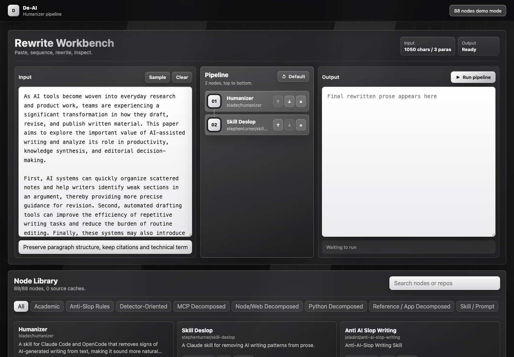
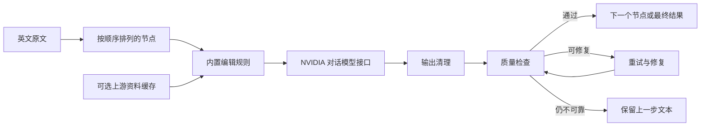
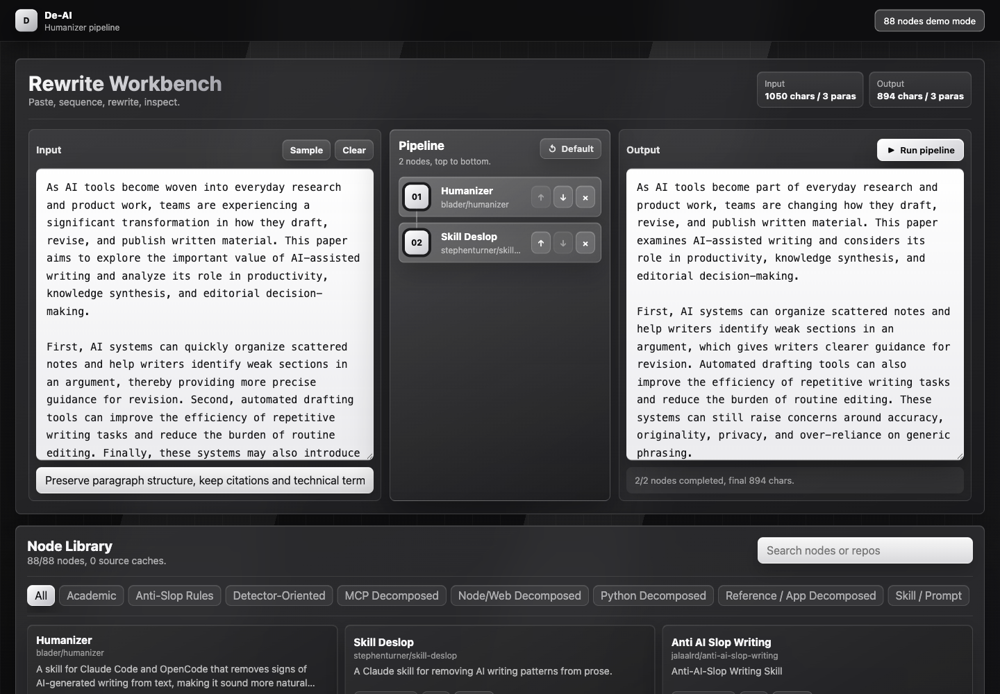
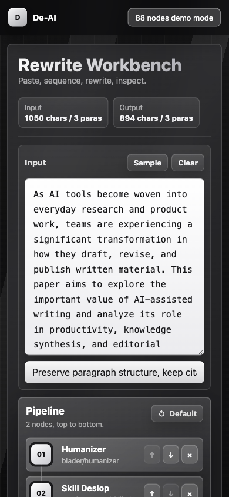

# De-AI 英文改写工作台

简体中文 | [English](README.md)


De-AI 是一个在本地浏览器中运行的英文改写工作台，主要用来处理结构重复、措辞空泛、模板感较强的英文文本。用户粘贴原文、选择并排序改写节点，后端便按顺序调用配置好的 NVIDIA 对话模型；每个节点返回结果后，Python 后端都会清理多余说明，检查段落数量和受保护内容，并对遗漏事实或破坏结构的结果自动重试、修复，必要时保留上一步文本。项目目前包含 88 个节点，覆盖学术写作、anti-slop、通用提示词、MCP、Python、Node/Web、检测器相关模式和参考应用等 8 类场景。



## 这个 Demo 到底是什么

它是一个“改写流程编排与质量检查”Demo，不是 88 个各自独立运行的模型。每个节点由下面几部分组成：

1. 本项目维护的一份内置编辑规则，共 8 类。
2. 节点自己的名称、用途、类别和上游项目等元数据。
3. 可选的本地上游 GitHub 仓库文本资料。
4. 一套所有节点共用的事实、结构和技术内容保护要求。

一个节点输出的文本会先经过检查，再交给下一个节点。这样做的好处是：用户能看见并调整处理顺序，而模型调用、输出清理、质量判断和失败回退都集中在同一个后端中，行为比较容易复现和排查。

## 项目概况

| 项目 | 实现方式 |
| --- | --- |
| 后端 | Python 标准库，`ThreadingHTTPServer` |
| 前端 | 通过 ES Module 加载 React 18，无需构建 |
| 模型接口 | 用户自行配置的 NVIDIA chat-completions 接口 |
| 节点库 | 8 个类别，共 88 个节点定义 |
| 内置规则 | 8 份由本项目维护的编辑规则 |
| 可选参考资料 | 浅克隆上游仓库，Git 默认忽略 |
| 质量控制 | 输出清理、受保护内容检查、段落检查、重试、修复和保守回退 |
| 自动化测试 | 110 项离线测试，模型调用使用模拟结果 |
| 安装依赖 | 后端不需要安装任何 Python 第三方包 |

## 为什么要做这个项目

模型生成的初稿通常有两个不同的问题：一是语言可能空泛、重复、像固定模板；二是再次改写时，数字、引用、术语、路径或责任主体又可能被改坏。De-AI 把这两个问题分开处理：节点负责调整措辞、节奏和句式，统一质量层负责检查数字、引用、URL、文件路径、工单编号、日期、金额、标准编号、代码片段、配置键和段落结构有没有丢失。

这套设计不承诺文本一定优秀，也不承诺任何检测结果。它提供的是一个看得见、能排序、能检查、能扩展的改写过程，让用户知道文本经过了哪些步骤，以及失败时系统采取了什么处理。

## 工作流程



信任边界、提示词拼装和回退逻辑详见 [架构说明](docs/ARCHITECTURE.md)。

## 主要功能

- 在三栏工作台中粘贴和查看英文文本。
- 从 88 个节点中搜索、按类别筛选并添加到流水线。
- 通过拖拽或上下移动按钮调整节点顺序。
- 为整次执行填写一条统一的改写备注。
- 尽量保持原文段落数量和段落顺序不变。
- 保护 URL、邮箱、文件路径、工单编号、CVE、DOI、日期、百分比、金额、标准、引用、配置键和行内代码。
- 清理模型擅自添加的标题、检测分数、解释、Markdown 代码围栏、表格和规则清单。
- 首次输出不合格时自动重试。
- 重试仍不理想时执行修复提示，必要时逐段处理。
- 结构仍然不可靠时保留上一步文本，避免错误继续传到后续节点。
- 不下载任何外部仓库也能使用内置规则；需要研究上游资料时再单独缓存。
- Python 后端不需要包管理器，前端不需要构建步骤。

## 截图

| 完成一次改写 | 移动端布局 |
| --- | --- |
|  |  |

完整截图索引和现场讲解顺序见 [演示指南](docs/DEMO.md)。

## 运行要求

- Python 3.10 或更高版本。
- 浏览器需要联网从 `esm.sh` 加载 React。
- 真实改写需要有效的 NVIDIA API 密钥，并且账号能够调用配置的模型。
- 只有在下载可选上游资料时才需要 Git。

后端只使用 Python 标准库。

## 快速开始

### 1. 克隆项目

```bash
git clone https://github.com/JiexiaoZhang1/de-ai-humanizer-workbench.git
cd de-ai-humanizer-workbench
```

### 2A. 先运行确定性的本地演示模式

如果只是想查看完整界面，不希望使用密钥或发起模型请求：

```bash
python3 server.py --demo --host 127.0.0.1 --port 8765
```

打开 [http://127.0.0.1:8765](http://127.0.0.1:8765)。右上角会明确显示 `demo mode`。这个模式只对项目自带示例做一组很小的确定性替换，所有处理留在本机，用于截图和界面讲解；它不会被描述成模型输出。

### 2B. 为真实改写配置 API 密钥

推荐使用环境变量：

```bash
export NVIDIA_API_KEY="your-key-here"
```

也可以创建本地配置文件：

```bash
cp config.example.json config.local.json
```

然后只在 `config.local.json` 中填写真实密钥。这个文件已经被 Git 忽略。不要把真实密钥写进 `config.example.json`、README、截图、Issue 或任何提交记录。

### 3. 启动真实模型服务

```bash
python3 server.py --host 127.0.0.1 --port 8765
```

浏览器打开 [http://127.0.0.1:8765](http://127.0.0.1:8765)。

默认只监听本机地址。这个标准库服务器用于本地 Demo；如果要对公网开放，需要另外增加身份验证、限流、请求控制和正式 Web 服务器。

## 配置项

环境变量优先于 `config.local.json`。

| 环境变量 | 本地 JSON 字段 | 默认值 | 作用 |
| --- | --- | --- | --- |
| `NVIDIA_API_KEY` | `nvidia_api_key` | 无 | 真实模型调用所需密钥 |
| `NVIDIA_API_URL` | `nvidia_url` | NVIDIA chat-completions 地址 | API 地址 |
| `NVIDIA_MODEL` | `nvidia_model` | `meta/llama-4-maverick-17b-128e-instruct` | 模型名称 |
| `DEAI_MAX_TOKENS` | `default_max_tokens` | `2200` | 单次生成的最大 token 数 |
| `DEAI_TEMPERATURE` | `temperature` | `0.82` | 采样温度 |
| `DEAI_TOP_P` | `top_p` | `0.95` | nucleus sampling 阈值 |
| `DEAI_CONFIG_FILE` | 无 | `config.local.json` | 指定另一份本地配置文件 |

`debug` 只能在 JSON 配置中设置，默认是 `false`。关闭时，后端会把意外异常记录在本机终端，但不会把完整调用栈返回给浏览器。

## 内置模式与来源增强模式

每个节点都有内置规则，所以公开仓库不需要携带最初调研时约 397 MB 的第三方仓库镜像。界面中的节点会显示两种状态：

- `Built-in`：只使用本项目内置规则和节点元数据。
- `Source cached`：除了内置规则，还会读取该节点在本机缓存的指定上游文件。

下载默认流水线对应的两个来源：

```bash
python3 tools/fetch_sources.py
```

下载指定节点的来源：

```bash
python3 tools/fetch_sources.py \
  --id blader_humanizer \
  --id stephenturner_skill_deslop
```

查看全部节点 ID 或下载所有来源：

```bash
python3 tools/fetch_sources.py --list
python3 tools/fetch_sources.py --all
```

下载内容放在 `repos/english-humanizers/`，保留各自上游许可证，并且不会进入本项目 Git 历史。下载脚本不会安装第三方依赖，也不会执行上游代码。将任何来源用作提示词资料前，都应该先人工查看。完整清单见 [第三方来源索引](docs/SOURCES.md)。

## API

前端使用三个 JSON 接口：

- `GET /api/health`：返回服务状态、是否配置密钥、节点数量和本地来源缓存数量。
- `GET /api/adapters`：返回节点定义和当前可用状态。
- `POST /api/run`：按顺序执行一条流水线。

请求示例：

```bash
curl -sS http://127.0.0.1:8765/api/run \
  -H 'Content-Type: application/json' \
  -d '{
    "text": "The original English text goes here.",
    "pipeline": ["blader_humanizer", "stephenturner_skill_deslop"],
    "note": "Keep the tone direct and preserve technical terms."
  }'
```

请求字段、响应结构和错误码详见 [API 文档](docs/API.md)。

## 质量检查如何工作

每个节点执行后，后端会依次：

1. 统一换行格式，并去掉最外层代码围栏。
2. 清理模型额外添加的标签、报告、分数和解释部分。
3. 在可以安全匹配时，恢复被模型改写的受保护内容。
4. 比较输入和输出的段落数量。
5. 检查受保护内容缺失、结果完全没改、长度变化过大、列表和表格等问题。
6. 首次检查失败时，使用更严格的要求自动重试。
7. 重试仍不充分时，使用专门的修复提示再次处理。
8. 对持续出现的段落结构或压缩问题，改为逐段重写。
9. 仍然无法通过保守检查时，保留进入当前节点之前的文本。

每个步骤的警告都会随 API 结果返回。通过这些检查只代表当前规则定义的结构和内容锚点没有明显破坏，不代表事实一定正确、文字一定优秀、作者身份得到证明，也不代表任何检测器会给出特定结果。

## 目录结构

```text
.
├── server.py                  # HTTP 服务、模型客户端、输出清理和质量检查
├── static/                    # React 工作台、HTML 元数据和样式
├── data/adapters.json         # 88 个节点定义
├── prompts/                   # 8 份本项目内置编辑规则
├── samples/sample.txt         # 英文示例输入
├── tools/
│   ├── fetch_sources.py       # 可选的上游来源浅克隆工具
│   ├── check_publication.py   # 已跟踪文件密钥与本地文件检查
│   └── qa_50_tests.py         # 离线回归测试
├── docs/                      # 架构、API、演示、演讲稿和来源索引
├── config.example.json        # 不含密钥的配置模板
└── .github/                   # CI 和协作模板
```

## 测试

运行离线测试：

```bash
python3 tools/qa_50_tests.py
```

测试会用确定性的模拟函数替换远程模型调用，覆盖配置、节点、受保护内容、输出清理、质量评分、流水线行为、HTTP 接口和前端结构，不会消耗真实 API 额度。

运行语法检查和发布保护检查：

```bash
python3 -m py_compile server.py tools/*.py
python3 tools/check_publication.py
```

服务端还提供两种节点级检查：

```bash
python3 server.py --self-test
python3 server.py --self-test-llm
```

`--self-test` 会跳过 LLM 节点，只检查本地结构；`--self-test-llm` 会对节点进行真实 API 调用，可能消耗较多时间和模型额度。

需要稳定演示浏览器流程且不调用模型时，使用 `python3 server.py --demo`。

## 安全与隐私

- 真实执行时，输入文本和拼装后的提示词会发送到配置的 NVIDIA 接口；`--demo` 模式不会把文本发送到模型接口。
- API 密钥不会发送给浏览器，也不会出现在健康检查响应中。
- `config.local.json`、`.env*`、下载仓库、QA 报告、日志和浏览器临时文件都被 Git 忽略。
- 发布检查会扫描所有已跟踪文件，寻找常见密钥格式和不应提交的本地文件。
- 上游文本只被当作不可信参考资料；系统提示明确要求模型忽略其中的工具调用、密钥请求和越权指令。
- 提示注入防护只能降低风险，无法保证任意第三方文本完全安全。

部署或分享日志前，请阅读 [SECURITY.md](SECURITY.md)。

## 使用边界与已知限制

De-AI 是编辑工作台，不负责判断文本是否由人创作，不保证任何检测器给出特定分类，不验证事实，也不能代替人工审稿。不要用它伪造证据、掩盖抄袭、虚假声明作者身份或规避必须遵守的披露要求。学校、单位、期刊和平台自己的规则仍然有效。

目前的主要限制：

- 模型可能保留一个数字或术语，却改变它周围句子的实际含义。
- 基于正则的受保护内容提取比较保守，但不可能覆盖所有领域格式。
- 节点越多，延迟、调用成本和语义漂移风险越高。
- 如果不自行打包 React，前端仍依赖公共 CDN。
- 当前标准库服务器适合本地 Demo，不适合多用户生产流量。
- 上游仓库内容可能变化，并且各自带有需要单独检查的许可证和说明。

## 相关文档

- [English README](README.md)
- [架构说明](docs/ARCHITECTURE.md)
- [API 文档](docs/API.md)
- [演示指南 / Demo Guide](docs/DEMO.md)
- [双语演讲稿 / Pitch and Speaker Script](docs/PITCH.md)
- [第三方来源索引 / Third-Party Source Index](docs/SOURCES.md)
- [安全策略](SECURITY.md)
- [参与贡献](CONTRIBUTING.md)

## 许可证与来源说明

本项目原创代码目前没有选择项目级开源许可证。仓库公开可见并不自动表示任何人获得了复制、修改或再发布权。可选上游项目是彼此独立的作品，分别受各自仓库和许可证约束；本仓库只保留元数据和链接，不重新分发那些项目的代码。完整列表见 [第三方来源索引](docs/SOURCES.md)。
